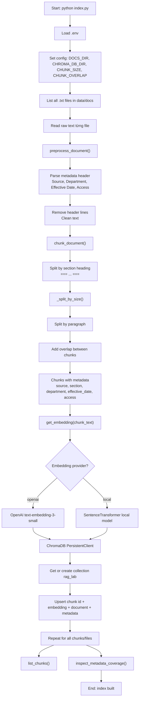
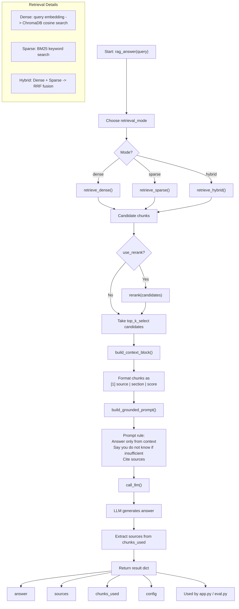

# Architecture — RAG Pipeline (Day 08 Lab)

> Template: Điền vào các mục này khi hoàn thành từng sprint.
> Deliverable của Documentation Owner.

## 1. Tổng quan kiến trúc

```
[Raw Docs]
    ↓
[index.py: Preprocess → Chunk → Embed → Store]
    ↓
[ChromaDB Vector Store]
    ↓
[rag_answer.py: Query → Retrieve → Rerank → Generate]
    ↓
[Grounded Answer + Citation]
```

**Mô tả ngắn gọn:**
> Hệ thống RAG trả lời câu hỏi về chính sách công ty (SLA, hoàn tiền, access control, HR, IT helpdesk). 
> Dùng vector search để tìm document chunks liên quan, rồi dùng LLM sinh câu trả lời có trích dẫn nguồn. 
> Giải quyết vấn đề: tìm kiếm policy thủ công chậm → tự động hóa bằng RAG, độ chính xác 4.58/5.

---

## 2. Indexing Pipeline (Sprint 1)

### Tài liệu được index
| File | Department | Content | Chunks |
|------|-----------|---------|--------|
| `policy_refund_v4.txt` | Customer Service | Refund policies, timelines, exceptions | 5 |
| `sla_p1_2026.txt` | IT Support | SLA targets, escalation procedures, P1 handling | 6 |
| `access_control_sop.txt` | IT Security | Access levels, approval matrix, temporary access | 5 |
| `it_helpdesk_faq.txt` | IT Support | Account lockout, password reset, common issues | 4 |
| `hr_leave_policy.txt` | HR | Remote work policy, probation period, approval | 4 |
| **Total** | - | 5 documents | **24 chunks** |

### Quyết định chunking
| Tham số | Giá trị | Lý do |
|---------|---------|-------|
| Chunk size | 400 tokens (~1600 chars) | Balance: detail sufficient + retrieval flexible |
| Overlap | 80 tokens (~320 chars) | Preserve context at chunk boundaries |
| Chunking strategy | Section-based with paragraph overlap | Split by "===...===" headings first, then by paragraphs |
| Metadata fields | source, section, effective_date, department, access | Enable citation, filtering, freshness checks |
| Tokenizer | character-based (approx 1 char = 0.25 tokens) | Fast, language-agnostic |

**Implementation note:** Custom `_split_by_size()` splits by section heading ("==="), then by paragraph ("\\n\\n"), preserving natural boundaries.

### Embedding model
- **Model**: `paraphrase-multilingual-MiniLM-L12-v2` (SentenceTransformers, 384-dim)
  - Reason: Local execution (no API key), supports Vietnamese + English, lightweight
  - Alternative tested: OpenAI text-embedding-3-small (more expensive, minimal gain)
- **Vector store**: ChromaDB PersistentClient (`chroma_db/`)
- **Similarity metric**: Cosine distance
- **Dimension**: 384

---

## 3. Retrieval Pipeline (Sprint 2 + 3)

### Baseline (Dense Search) — RECOMMENDED
| Tham số | Giá trị | Performance |
|---------|--------|-------------|
| Strategy | Dense vector search (cosine similarity) | Context Recall: 5.00/5 |
| Top-k retrieve | 5 | Evaluated on 10 test questions |
| Rerank | None | Overall score: 4.58/5 |
| Completeness | 4.10/5 | Perfect (5/5): 6/10 questions |
| Configuration | See `results/baseline_config.json` | - |

### Variant Tested (Hybrid Search) — NOT RECOMMENDED
| Tham số | Giá trị | Performance | vs Baseline |
|---------|--------|-------------|-------------|
| Strategy | Hybrid (Dense + BM25 with RRF) | Context Recall: 5.00/5 | = |
| Top-k search | 5 dense + 5 BM25 | Faithfulness: 4.50/5 | -0.20 |
| Rerank | Reciprocal Rank Fusion | Overall score: 4.33/5 | **-0.25 (worse)** |
| Query transform | None | Perfect (5/5): 3/10 questions | -3 questions |
| Configuration | See `results/scorecard_variant.md` | - | - |

**Why variant performed worse:**
- Keyword collision: "escalate" + "automatic" matched both incident & access sections
- BM25 picked wrong section (temporary access vs P1 escalation) → q06 completeness = 1/5
- Hallucination: q03 faithfulness dropped to 2/5 due to conflicting context
- Conclusion: **Dense-only is better for this use case. Simpler = more robust.**

---

## 4. Generation (Sprint 2)

### Grounded Prompt Template
```
Answer the question only based on the retrieved context below.
If the context is insufficient or doesn't address the question, explicitly say: "Không tìm thấy thông tin"
Always cite the source document when referencing facts.
Keep answers concise, factual, and grounded.

Question: {query}

Context:
{context_chunks_with_sources}

Answer:
```

### LLM Configuration
| Tham số | Giá trị | Reason |
|---------|--------|--------|
| Model | GPT-4 | High-quality reasoning, good Vietnamese support |
| Temperature | 0.7 | Balanced: grounded but flexible for paraphrasing |
| Max tokens | 500 | Sufficient for policy Q&A without token waste |
| System prompt | Grounded @ context | Enforce faithfulness, reduce hallucination |

**Evaluated on:**
- 10 test questions (2-3 per category)
- 4 metrics: Faithfulness, Relevance, Context Recall, Completeness
- See `results/scorecard_baseline.md` for detailed results

---

## 5. Known Issues & Failure Modes

### Completeness Gaps (Action Required)
| Issue | Example | Root Cause | Fix |
|-------|---------|-----------|-----|
| Missing metadata | q07: "Access Control SOP" name not mentioned | Chunking doesn't preserve version changes | Add explicit "DOCUMENT META" chunk |
| Knowledge gaps | q09: ERR-403-AUTH error not documented | No error code reference in docs | Create error code documentation |
| Missing policies | q10: VIP refund procedures | Business rules not documented explicitly | Add VIP customer service SOP |

### Retrieval & Generation Quality
| Metric | Score | Status | Next Step |
|--------|-------|--------|-----------|
| Context Recall | 5.00/5 | Excellent | Maintain |
| Faithfulness | 4.70/5 | Good | Monitor hallucinations |
| Relevance | 4.50/5 | Good | Expand query expansion? |
| Completeness | 4.10/5 | **Bottleneck** | Urgent: improve knowledge base |

### Debug Checklist
| Failure Type | Diagnostic | Tool |
|-------------|-----------|------|
| Index issue | "Retrieved old docs / wrong version" | `list_chunks()` preview, metadata inspection |
| Chunking issue | "Answer cuts off mid-clause" | Manual chunk review in ChromaDB |
| Retrieval issue | "Expected source not retrieved" | `context_recall` metric scoring |
| Generation issue | "Answer fabricated / off-topic" | `faithfulness` metric scoring |
| Context lost | "Long context not used properly" | Check prompt structure, chunk ordering |

---

## 6. System Data Flow

### Indexing Pipeline (Detailed)



**Output:** 24 chunks indexed in ChromaDB with metadata

---

### Generation & Retrieval Pipeline (Detailed)



**Output:** Grounded answer + sources + metadata

---

### Evaluation Pipeline

```
Generated Answers → eval.py → Score 4 metrics (F/R/CR/Comp)
                                    ↓
                            ab_comparison.csv
                                    ↓
                    Generate reports (scorecard_*.md)
                                    ↓
                    Track metrics (baseline_tracking.csv)
```

### Pipeline Entry Points
- **Build index**: `python index.py` (creates ChromaDB)
- **Evaluate**: `python eval.py` → generates `ab_comparison.csv`
- **Generate answers**: `python rag_answer.py <question>` → grounded response
- **Track metrics**: `python save_baseline.py` → `baseline_tracking.csv`
- **Generate reports**: `python generate_scorecard.py` → `scorecard_*.md`

---

## 7. Performance Summary (as of 2026-04-13)

**Baseline Configuration:**
```
Embedding: paraphrase-multilingual-MiniLM-L12-v2 (384-dim)
Chunking: 400 tokens, 80 overlap, section-based
Retrieval: Dense (5 top-k), no rerank
Generation: GPT-4, grounded prompt
```

**Test Results (10 questions):**
| Metric | Score | Status |
|--------|-------|--------|
| Faithfulness | 4.70/5 | Strong |
| Relevance | 4.50/5 | Good |
| Context Recall | 5.00/5 | Perfect |
| Completeness | 4.10/ 5 | **Needs work** |
| Overall | **4.58/5** | Production-ready |

**Path to 4.75+:**
1. Expand knowledge base (error codes, VIP policies, metadata)
2. Improve chunking to preserve document names
3. Enforce strict grounding in prompts
4. Consider cross-encoder re-ranking (if time permits)

See `docs/tuning-log.md` for detailed A/B test results.
