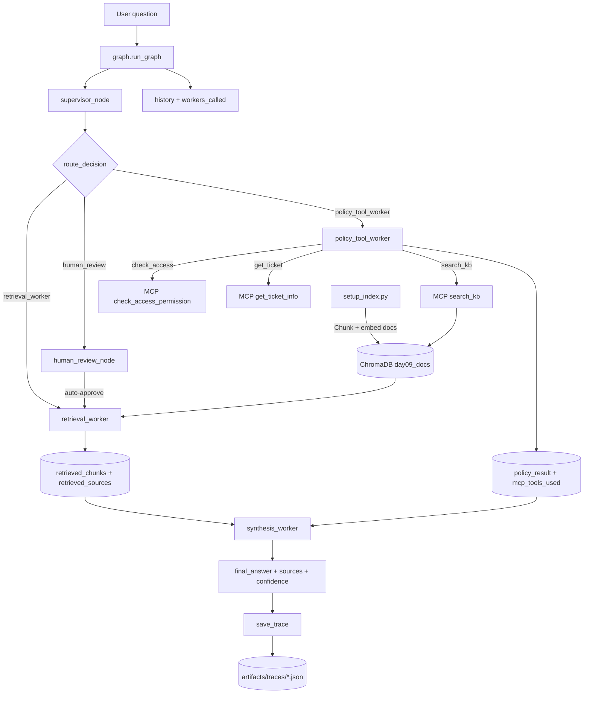

# System Architecture — Lab Day 09

**Nhóm:** Nhom25  
**Ngày:** 14/04/2026  
**Version:** 1.0

---

## 1. Tổng quan kiến trúc

Hệ thống dùng pattern **Supervisor-Worker** với một shared state đi xuyên toàn pipeline.

Các thành phần chính:
- `setup_index.py`: chunk + embed tài liệu và build Chroma collection `day09_docs`.
- `graph.py`: orchestrator điều phối route.
- `workers/retrieval.py`: lấy evidence chunks từ ChromaDB.
- `workers/policy_tool.py`: kiểm tra policy/exception và gọi MCP tools khi cần.
- `workers/synthesis.py`: tổng hợp final answer có source + confidence.
- `mcp_server.py`: cung cấp tools `search_kb`, `check_access_permission`, `get_ticket_info`, `create_ticket`.

**Pattern đã chọn:** Supervisor-Worker  
**Lý do chọn pattern này (thay vì single agent):**

- Tách vai trò rõ ràng nên debug nhanh hơn khi sai (biết sai ở route, retrieval, policy hay synthesis).
- Dễ mở rộng capability qua worker hoặc MCP tool mà không phải sửa toàn bộ prompt monolith.
- Có trace chi tiết (`route_reason`, `workers_called`, `mcp_tools_used`) nên quan sát tốt hơn.

---

## 2. Sơ đồ Pipeline

**Luồng thực thi trong `graph.py`:**

1. Supervisor phân tích câu hỏi và ghi `supervisor_route`, `route_reason`, `risk_high`, `needs_tool`.
2. Route qua 1 trong 3 nhánh:
- `retrieval_worker` trực tiếp.
- `policy_tool_worker`: chạy retrieval trước (nếu chưa có chunks) rồi policy/MCP.
- `human_review`: HITL placeholder, lab mode auto-approve rồi fallback retrieval.
3. Luôn chạy `synthesis_worker` ở cuối để tạo output chuẩn.
4. Ghi trace JSON vào `artifacts/traces`.

---

## 3. Vai trò từng thành phần

### Supervisor (`graph.py`)

| Thuộc tính | Mô tả |
|-----------|-------|
| **Nhiệm vụ** | Phân loại task, quyết định route và flags điều phối (`needs_tool`, `risk_high`). |
| **Input** | `task` từ user trong `AgentState`. |
| **Output** | `supervisor_route`, `route_reason`, `risk_high`, `needs_tool`. |
| **Routing logic** | Keyword-based: policy/access (`hoàn tiền`, `level`, `admin access`) → policy tool; knowledge (`sla`, `ticket`, `p1`, `remote`) → retrieval; có tín hiệu multi-hop SLA+access thì ép route về policy+MCP. |
| **HITL condition** | Nếu phát hiện mã lỗi không rõ dạng `ERR-...` thì route `human_review` (lab mode auto-approve). |

### Retrieval Worker (`workers/retrieval.py`)

| Thuộc tính | Mô tả |
|-----------|-------|
| **Nhiệm vụ** | Dense retrieval từ ChromaDB, trả chunks + sources làm evidence. |
| **Embedding model** | `text-embedding-3-small` (OpenAI, 1536-dim; fallback random vector cho smoke test). |
| **Top-k** | Mặc định `3` (có thể override qua state/env). |
| **Stateless?** | Yes (đọc input và chỉ ghi output theo contract). |

### Policy Tool Worker (`workers/policy_tool.py`)

| Thuộc tính | Mô tả |
|-----------|-------|
| **Nhiệm vụ** | Rule-based policy analysis + gọi MCP tools cho case cần kiểm chứng access/ticket. |
| **MCP tools gọi** | `search_kb` (khi thiếu chunks), `check_access_permission`, `get_ticket_info`. |
| **Exception cases xử lý** | `flash_sale_exception`, `digital_product_exception`, `activated_exception`, và temporal scoping (đơn trước 01/02/2026). |

### Synthesis Worker (`workers/synthesis.py`)

| Thuộc tính | Mô tả |
|-----------|-------|
| **LLM model** | Chain: OpenAI `gpt-4o-mini` → Gemini `gemini-1.5-flash` → local fallback. |
| **Temperature** | `0.1` (OpenAI và Gemini). |
| **Grounding strategy** | Prompt bắt buộc chỉ dùng context từ `retrieved_chunks`, `policy_result`, `access_check`, `ticket_info`; bắt buộc citation. |
| **Abstain condition** | Không có chunks hoặc context không đủ thì trả lời dạng “Không đủ thông tin trong tài liệu nội bộ.” |

### MCP Server (`mcp_server.py`)

| Tool | Input | Output |
|------|-------|--------|
| `search_kb` | `query`, `top_k` | `chunks`, `sources`, `total_found` |
| `get_ticket_info` | `ticket_id` | ticket details (`priority`, `status`, `assignee`, `sla_deadline`, `notifications_sent`) |
| `check_access_permission` | `access_level`, `requester_role`, `is_emergency` | `can_grant`, `required_approvers`, `approver_count`, `emergency_override`, `notes` |
| `create_ticket` | `priority`, `title`, `description` | `ticket_id`, `url`, `created_at`, `sla_deadline` (mock) |

---

## 4. Shared State Schema

| Field | Type | Mô tả | Ai đọc/ghi |
|-------|------|-------|-----------|
| `task` | str | Câu hỏi đầu vào | Supervisor đọc |
| `supervisor_route` | str | Route được chọn | Supervisor ghi, graph đọc |
| `route_reason` | str | Lý do chọn route | Supervisor ghi, trace đọc |
| `risk_high` | bool | Cờ rủi ro cao | Supervisor ghi |
| `needs_tool` | bool | Cờ cho phép gọi MCP | Supervisor ghi, policy worker đọc |
| `hitl_triggered` | bool | Có trigger human review không | Human review ghi |
| `retrieved_chunks` | list | Evidence chunks từ retrieval | Retrieval ghi, synthesis/policy đọc |
| `retrieved_sources` | list | Danh sách source sau retrieval | Retrieval ghi, synthesis đọc |
| `policy_result` | dict | Kết quả policy + access/ticket check | Policy worker ghi, synthesis đọc |
| `mcp_tools_used` | list | Log tool calls MCP | Policy worker ghi |
| `final_answer` | str | Câu trả lời cuối | Synthesis ghi |
| `sources` | list | Nguồn trích dẫn trong output | Synthesis ghi |
| `confidence` | float | Độ tin cậy câu trả lời | Synthesis ghi |
| `history` | list | Event log theo thứ tự node | Supervisor/workers/graph ghi |
| `workers_called` | list | Chuỗi workers đã chạy | Workers/HITL ghi |
| `worker_io_logs` | list | Log I/O chuẩn contract | Mỗi worker append |
| `latency_ms` | int \| null | Tổng thời gian run | Graph ghi |
| `run_id` | str | ID định danh trace | Graph init |
| `timestamp` | str | Thời điểm bắt đầu run | Graph init |

---

## 5. Lý do chọn Supervisor-Worker so với Single Agent (Day 08)

| Tiêu chí | Single Agent (Day 08) | Supervisor-Worker (Day 09) |
|----------|----------------------|--------------------------|
| Debug khi sai | Khó isolate lỗi vì monolithic | Dễ hơn: test độc lập từng worker + trace theo node |
| Thêm capability mới | Sửa prompt hoặc flow chính | Thêm worker/tool mà ít ảnh hưởng thành phần khác |
| Routing visibility | Không có | Có `supervisor_route` + `route_reason` |
| Tool integration | Hard-code trực tiếp | Chuẩn hóa qua MCP tools/logs |
| Observability | Chủ yếu final output | Có `history`, `workers_called`, `worker_io_logs`, `mcp_tools_used` |

**Quan sát từ thực tế lab (15 câu eval):**

- Route accuracy: `93.33%` (`14/15` đúng).
- Routing distribution: retrieval `8/15` (53.3%), policy tool `7/15` (46.7%).
- MCP usage rate: `3/15` (20.0%), HITL rate: `1/15` (6.7%).
- Avg latency Day09: `3106ms` (đổi lại có trace và modularity tốt hơn).

---

## 6. Giới hạn và điểm cần cải tiến

1. Routing hiện là keyword-based nên còn false positive ở câu “fact retrieval” nhưng chứa từ policy (đã thấy 1 case route sai ở eval).
2. `human_review` mới là placeholder auto-approve trong lab; production cần cơ chế interrupt/queue thực sự.
3. MCP `search_kb` hiện là nhánh fallback và chưa được tận dụng nhiều do flow policy thường đã có retrieval trước.
