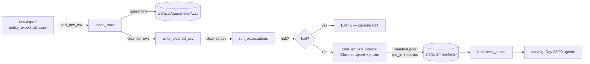

# Kiến trúc pipeline — Lab Day 10

**Nhóm:** 25
**Cập nhật:** 2026-04-15

---

## 1. Sơ đồ luồng

Điểm đo chính:
- **run_id** được sinh ở `cmd_run()` (UTC timestamp hoặc cờ `--run-id`). Ghi ở: log, manifest, metadata Chroma (`run_id` field).
- **Freshness** đo tại **publish boundary**: trường `latest_exported_at` trong manifest (max `exported_at` của cleaned rows). SLA mặc định `FRESHNESS_SLA_HOURS=24`.
- **Quarantine** tại `artifacts/quarantine/quarantine_<run_id>.csv` với cột `reason`.

---

## 2. Ranh giới trách nhiệm

| Thành phần | Input | Output | Owner nhóm |
|------------|-------|--------|------------|
| Ingest | `data/raw/policy_export_dirty.csv` | list rows (dict), raw_records | Ingestion Owner |
| Transform | raw rows | cleaned rows + quarantine rows | Cleaning & Quality Owner |
| Quality | cleaned rows | `ExpectationResult[]`, flag halt | Cleaning & Quality Owner |
| Embed | cleaned CSV | Chroma collection `day10_kb` (upsert + prune) | Embed Owner |
| Monitor | manifest.json | status PASS/WARN/FAIL | Monitoring / Docs Owner |

---

## 3. Idempotency & rerun

- **Upsert theo `chunk_id`**: `chunk_id = f"{doc_id}_{seq}_{sha256(doc_id|text|seq)[:16]}"` — thay đổi text sẽ đổi id, chống collision.
- **Prune** trước upsert: so `prev_ids` (lấy từ `col.get(include=[])`) với `ids` lần này, xoá phần dư (`embed_prune_removed` trong log). Đảm bảo collection là **snapshot publish** — không còn chunk stale sau `run`.
- Chạy `etl_pipeline.py run` 2 lần liên tiếp: cùng số lượng vector, không phình bộ nhớ.

---

## 4. Liên hệ Day 09

- Pipeline dùng **chung `data/docs/`** với Day 09 (cùng 4 doc: refund, sla P1, helpdesk, HR leave).
- Collection Chroma **tách riêng** (`day10_kb` vs Day 09) để tránh tranh chấp grading / test retrieval. Day 09 có thể trỏ collection `day10_kb` nếu muốn test refresh pipeline — ghi trong runbook.
- Xem `docs/runbook.md` mục Mitigation để rollback về collection Day 09 khi cần.

---

## 5. Rủi ro đã biết

- CSV mẫu có `exported_at=2026-04-10T08:00:00` — chạy trong 2026-04 sẽ báo `freshness=FAIL` nếu SLA_HOURS=24. Xử lý: runbook điều chỉnh SLA hoặc cập nhật timestamp demo.
- `--skip-validate` chỉ dành cho Sprint 3 demo; chạy pipeline production luôn phải validate.
- Rule `future_effective_date` dùng `date.today()` → có thể false-positive khi chạy CI trong quá khứ; mitigation: nhận cutoff từ env (cải tiến 2h).
